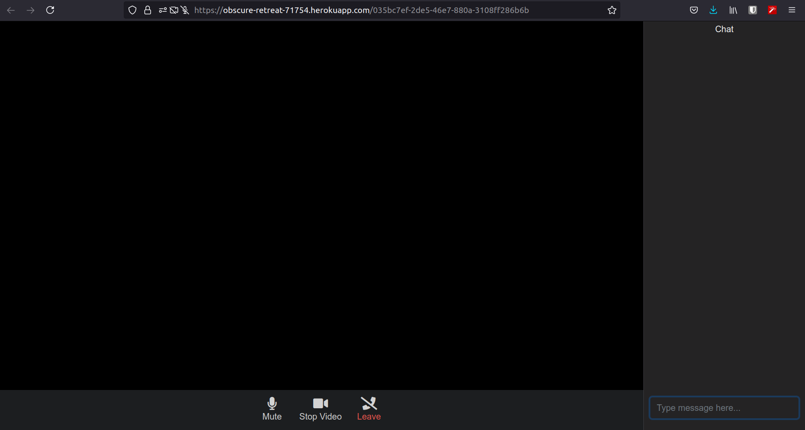

# teams-app-clone
A simple teams app clone created  for Microsoft Engage 2021 mentorship programme. It uses peer to peer communication using socket.io rather than webRTC as this enables the server to initiate requests too, rather than waiting for the client to do so. 

The app is hosted on heroku, to try it out click [here](https://obscure-retreat-71754.herokuapp.com/).

Technology requirements:
- Node.js
- Express
- Socket.io
- Peer.js
- uuid
- heroku 

# Usage Guide
THe app because of being fairly primitve, is rather simple to use. On opening the url, the user is redirected to page with a unique id, which can be shared through email or any other medium as per need. There are options for muting, stoppping video share and leaving the meeting which results in that particular tab being closed and the user is removed from the room for everyone else. 

There is a chat side application too, for sharing of text messages among the clients though presently the app does not distinguish among the users and just displays the input message along with the moniker *user* which makes it confusing.

# Further Improvements
There is a definite room for improvements where a number of things have to be rehashed or added. Following is a small list of tasks that could be done to make it much better:
- The chat side application needs some way of distinguishing users.
- A screen share option can be implemented.
- At present the app resides on heroku which is free of cost to use, but the down side is that it is unable to handle a huge load of users, for example more than 4 users ina meeting cause a non-trivial lag in the video and audio stream.
- A way to record/save meetings could be there.
- A profile log-in system caan aslso be added which would help in the first point itself.

